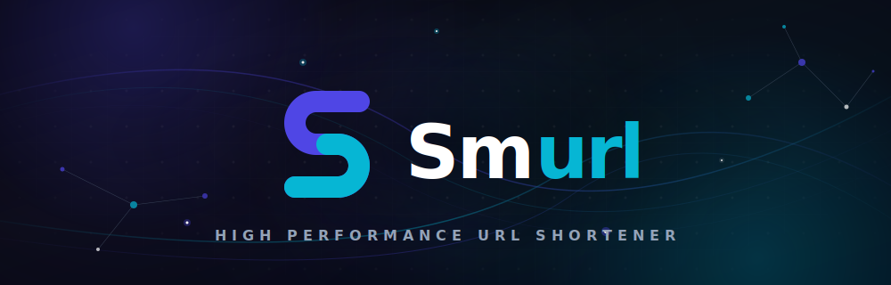
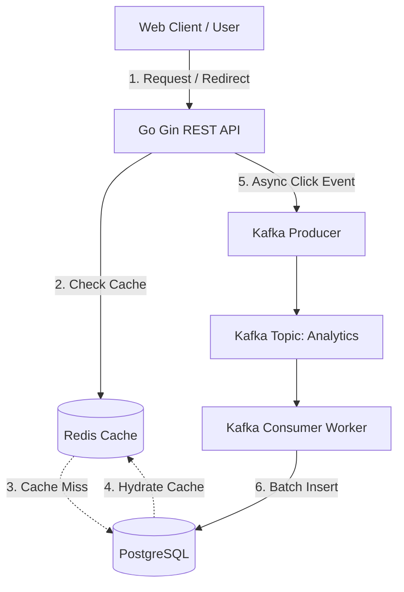
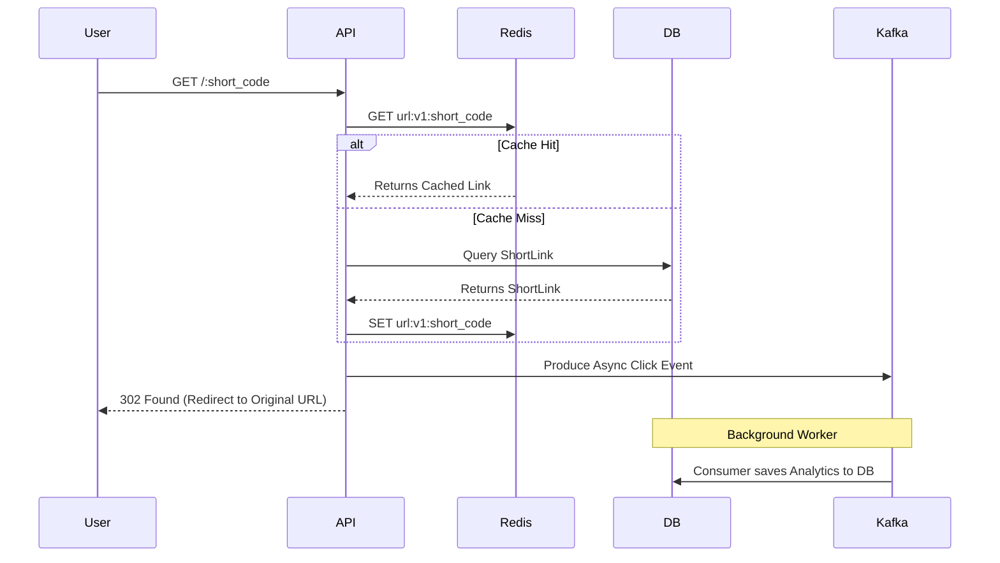

<div align="center">

# Smurl 🚀

*A high-performance, analytics-driven URL shortener built for speed and scale.*



[](https://golang.org/)
[](https://react.dev/)
[](https://www.postgresql.org/)
[](https://redis.io/)
[](https://kafka.apache.org/)
[](https://opensource.org/licenses/MIT)
[]()

</div>

---

## 🎯 Project Overview

**The Problem:** Traditional URL shorteners often struggle with two competing concerns: delivering lightning-fast redirects to users while simultaneously capturing detailed, high-volume click analytics. Synchronous writes to a database during the redirection flow introduce latency, degrading the end-user experience.

**Who It Is For:** Developers, marketers, and enterprises who need a reliable infrastructure to manage shortened links, track engagement deeply, and scale without bottlenecks.

**Engineering Goals:**
- **Zero-Latency Redirections:** Serve redirects exclusively from cache.
- **Event-Driven Analytics:** Ingest click events asynchronously without blocking HTTP responses.
- **Resilient Architecture:** Ensure that spikes in traffic do not overwhelm the primary database.
- **Developer Experience:** Maintain a clean, maintainable, and strongly-typed codebase across the stack.

### Why I Built Smurl

Most URL shorteners are simple CRUD applications. I wanted to build something closer to a production backend by introducing concepts commonly used in distributed systems:

- Cache-first architecture using Redis
- Event-driven analytics with Kafka
- Asynchronous background processing
- Runtime frontend configuration
- Modular Go project structure
- Feature-based React architecture

The primary objective wasn't simply shortening URLs—it was designing a scalable backend that demonstrates real-world engineering practices.

---

## 🏗 Architecture Diagram



---

## 🏛 Architecture Overview

- **Frontend:** A single-page application built with React 19 and Vite. It utilizes Zustand for global state, React Query for robust server-state management, and Tailwind CSS for utility-first styling.
- **Backend:** A monolithic REST API written in Go using the Gin framework, structured around clean architecture principles (Handlers → Services → Repositories).
- **Database (PostgreSQL):** Acts as the primary source of truth for user accounts, short link metadata, and aggregated analytics.
- **Cache (Redis):** Stores active short links to ensure redirects bypass the database entirely.
- **Message Queue (Kafka):** Brokers high-throughput click events. The API acts as a producer, and a background worker runs as a consumer to process events asynchronously.
- **Authentication:** Stateless JWT-based authentication for securing the dashboard and management APIs.
- **Runtime Configuration:** The frontend determines its API target dynamically at runtime via a window-injected configuration (`config.js`), allowing a single build artifact to be deployed across multiple environments.

---

## 🧠 Engineering Decisions

### Why These Technologies?

- **Why Go instead of Node.js?** Go’s exceptional concurrency model (goroutines) and raw execution speed make it ideal for an API where milliseconds matter. It handles high-throughput I/O operations (like proxying redirects and pushing to Kafka) vastly better than a single-threaded runtime.
- **Why Gin?** Gin provides a minimalist, high-performance HTTP router with zero allocation overhead, allowing us to build predictable, fast REST endpoints without the bloat of heavier frameworks.
- **Why PostgreSQL?** The relational model perfectly suits our domain—Users own Links, and Links have many Analytics events. Postgres offers the ACID guarantees and advanced querying capabilities needed for reliable data aggregation.
- **Why Redis?** Disk I/O is the enemy of fast redirects. Redis keeps our active link mappings in memory, enabling O(1) lookup times and ensuring the database is only hit for cache misses or administrative mutations.
- **Why Kafka?** A popular link might receive thousands of clicks per second. Kafka acts as a shock absorber. Instead of overwhelming Postgres with synchronous `INSERT` statements, the API fires a non-blocking event to Kafka, and a consumer worker batches writes to the database at its own pace.
- **Why React 19 & Vite?** React remains the industry standard for component-driven UI, and Vite provides an unparalleled developer experience with instant HMR (Hot Module Replacement) and optimized production builds.
- **Why Tailwind CSS?** It allows for rapid UI iteration without context-switching between markup and stylesheets, keeping CSS payload sizes minimal in production.

---

## ✨ Key Features

### Authentication
- JWT-based stateless authentication.
- Secure user registration and login workflows.
- Session termination (Logout).

### Link Management
- Generate short links with optional custom aliases.
- Toggle active/inactive status to instantly pause redirection.
- Modify the destination of existing short links.
- Generate and download PNG QR codes for offline sharing.

### Analytics
- **Click Tracking:** Capture IP address, User Agent, and timestamps.
- **Device Breakdown:** Parse user agents to categorize traffic by device type.
- **Time Series Data:** View daily click aggregates and historical timelines.

### Developer Experience
- Runtime environment configuration for seamless deployments.
- Clean architectural boundaries separating HTTP transport from business logic.

---

## ⚡ Performance Optimizations

- **Redis Caching:** All `/:code` redirect endpoints query Redis first. The database is only queried on a cache miss, followed by immediate cache hydration.
- **Asynchronous Analytics:** Click events are fired into Kafka asynchronously. The HTTP redirect response is sent to the user without waiting for the database write.
- **Cache Invalidation:** When a user updates or deletes a link, the specific Redis key is immediately invalidated to prevent stale redirects.
- **Runtime Configuration:** The frontend avoids hardcoded environment variables at build time, using `window.env` to dynamically route API requests based on the host origin.

---

## ⚙️ System Design

### Request Lifecycle: Redirect Flow



---

## 📂 Project Structure

```text
d:\Projects\smurl\
├── backend/
│   ├── cmd/
│   │   └── api/          # Application entrypoint (wires dependencies and starts server)
│   ├── internal/
│   │   ├── analytics/    # Bounded context: Event tracking, Kafka consumer, Stats API
│   │   ├── auth/         # Bounded context: User registration, Login, JWT issuing
│   │   ├── config/       # Environment variable parsing and validation
│   │   ├── middleware/   # HTTP interceptors (JWT validation, CORS)
│   │   ├── platform/     # Infrastructure bindings (DB connection, Kafka, Redis)
│   │   ├── url/          # Bounded context: Link creation, caching, redirection
│   │   └── utils/        # Cross-cutting concerns (Error handling, HTML rendering)
│   └── migrations/       # SQL schema definitions
├── frontend/
│   ├── public/           # Static assets and runtime config (config.js)
│   ├── src/
│   │   ├── api/          # Axios interceptors and typed API wrappers
│   │   ├── components/   # Dumb/Presentation components (Buttons, Modals)
│   │   ├── features/     # Smart components grouped by domain (Links, Auth, Analytics)
│   │   ├── lib/          # Helper functions and runtime config getter
│   │   ├── pages/        # Top-level route entrypoints
│   │   └── routes/       # React Router definitions and auth guards
│   ├── package.json      
│   └── vite.config.ts    
└── .env.example          # Environment template
```

---

## 💻 Tech Stack

| Category | Technology |
|---|---|
| **Frontend Framework** | React 19, TypeScript, Vite |
| **Styling** | Tailwind CSS, Lucide React |
| **State & Data Fetching** | Zustand, React Query |
| **Backend Language** | Go (v1.20+) |
| **Backend Framework** | Gin |
| **Database** | PostgreSQL |
| **Caching Layer** | Redis |
| **Message Broker** | Apache Kafka |

---


## 🚀 Installation

### Prerequisites
- Go (1.20+)
- Node.js (18+)
- PostgreSQL
- Redis
- Kafka (e.g., via Docker)

### 1. Environment Setup

Clone the repository and configure your environment variables:

```bash
git clone <repository-url> smurl
cd smurl
cp .env.example .env
```

### 2. Infrastructure Setup (Local)
Ensure your PostgreSQL, Redis, and Kafka instances are running and accessible according to your `.env` configuration.

### 3. Backend Setup

```bash
cd backend
go mod download
go run ./cmd/api/main.go
```
*Note: The Go server automatically runs database migrations on startup.*

### 4. Frontend Setup

```bash
cd frontend
npm install
npm run dev
```

### Production Build
To build the frontend for production:
```bash
cd frontend
npm run build
```

---

## 🔐 Environment Variables

| Variable | Description | Example |
|---|---|---|
| `BASE_URL` | The public URL of the backend API | `http://localhost:8080` |
| `SERVER_PORT` | The port the Go server will bind to | `8080` |
| `DB_HOST` | PostgreSQL host address | `localhost` |
| `DB_PORT` | PostgreSQL port | `5432` |
| `DB_USER` | PostgreSQL username | `postgres` |
| `DB_PASSWORD` | PostgreSQL password | `mypassword` |
| `DB_NAME` | PostgreSQL database name | `smurl` |
| `DB_SSLMODE` | PostgreSQL SSL configuration | `disable` |
| `REDIS_ADDR` | Redis connection string | `localhost:6379` |
| `REDIS_PASSWORD` | Redis password (if applicable) | ` ` |
| `REDIS_DB` | Redis logical database index | `0` |
| `JWT_SECRET` | Secret key used for signing JWTs | `super-secret-key` |
| `KAFKA_BROKERS` | Kafka broker addresses | `localhost:9092` |
| `KAFKA_TOPIC` | Kafka topic for analytics events | `click-events` |
| `KAFKA_GROUP_ID` | Kafka consumer group ID | `analytics-group` |

---

## 🛠 Engineering Challenges Solved

- **Zero-Downtime Cache Invalidation:** Implemented targeted Redis key deletion (`DEL url:v1:code`) immediately upon a link update or deletion, ensuring users never experience stale redirects without resorting to expensive cache sweeps.
- **Write-Heavy Analytics:** Solved the classic "write-heavy analytics locking the DB" problem by introducing Kafka. The API produces a lightweight JSON message and immediately returns a 302. The consumer handles the DB I/O in the background.
- **Build Once, Deploy Anywhere:** Solved frontend environment coupling by implementing a runtime configuration pattern (`config.js`). The React app queries `window.env` to resolve its backend target dynamically, eliminating the need to rebuild the Vite bundle for Staging and Production.

---

## 🗺 Future Roadmap

Based on the current architecture, these enhancements are planned:
- **Dockerization:** Provide `Dockerfile` and `docker-compose.yml` for single-command stack orchestration.
- **Geospatial Analytics:** Integrate a GeoIP database in the Kafka consumer to track click origins by country and city.
- **Advanced Link Controls:** Implement password-protected links and automated link expiration (schema support exists).
- **Rate Limiting:** Implement token-bucket rate limiting via Redis to protect the API from abuse.
- **Automated Testing:** Expand unit and integration test coverage for core Go services.

